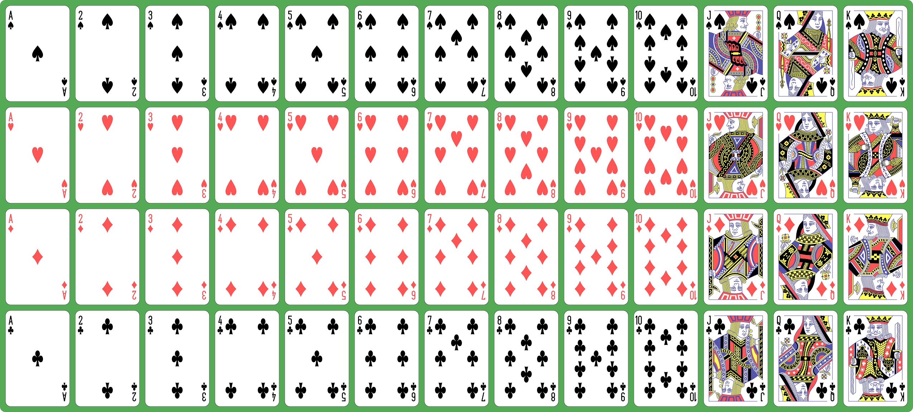

# Språkvansker

Det er funnet en mistenkelig fil med navn "korstokk.png". Det er sikret en minnedump av maskinen. Finner du ut noe mer?

--------------------------------------------------------------------------


```sh
binwalk korstokk.png
------------------------------------------------------------------------------------------------------------------------
DECIMAL                            HEXADECIMAL                        DESCRIPTION
------------------------------------------------------------------------------------------------------------------------
0                                  0x0                                PNG image, total size: 859510 bytes
859510                             0xD1D76                            7-zip archive data, version 0.4, total size: 170
                                                                      bytes
------------------------------------------------------------------------------------------------------------------------
```

Ligger en passordbeskyttet .zip skjupt i korstokk.png, antar at passordet ligger i minnedump

Kjører volatility for kjapp analyse av hva som ble kjørt osv
```sh
login@corax ~/2_oppdrag/2.20_Språkvansker $ vol -f minnedump windows.cmdline
4       System  -
2728    spoolsv.exe     C:\WINDOWS\System32\spoolsv.exe
2520    VGAuthService.  "C:\Program Files\VMware\VMware Tools\VMware VGAuth\VGAuthService.exe"
2384    vmtoolsd.exe    "C:\Program Files\VMware\VMware Tools\vmtoolsd.exe"
2288    vm3dservice.ex  "C:\Program Files\VMware\VMware Tools\vm3dservice.exe"
3080    MsMpEng.exe     "C:\Program Files\Windows Defender\MsMpEng.exe"
3112    wlms.exe        C:\WINDOWS\system32\wlms\wlms.exe
3384    vm3dservice.ex  "C:\Program Files\VMware\VMware Tools\vm3dservice.exe" -n
3728    dllhost.exe     C:\WINDOWS\system32\dllhost.exe /Processid:{02D4B3F1-FD88-11D1-960D-00805FC79235}
3844    WmiPrvSE.exe    C:\WINDOWS\system32\wbem\wmiprvse.exe
3904    msdtc.exe       C:\WINDOWS\System32\msdtc.exe
4108    taskhostw.exe   taskhostw.exe {222A245B-E637-4AE9-A93F-A59CA119A75E}
4944    ShellHost.exe   "C:\Windows\System32\ShellHost.exe"
5012    AggregatorHost  AggregatorHost.exe
6104    NisSrv.exe      "C:\Program Files\Windows Defender\NisSrv.exe"
1920    vmtoolsd.exe    "C:\Program Files\VMware\VMware Tools\vmtoolsd.exe" -n vmusr
6080    ApplicationFra  C:\WINDOWS\system32\ApplicationFrameHost.exe -Embedding
6260    LockApp.exe     "C:\Windows\SystemApps\Microsoft.LockApp_cw5n1h2txyewy\LockApp.exe" -ServerName:WindowsDefaultLockScreen.AppX7y4nbzq37zn4ks9k7amqjywdat7d3j2z.mca
5172    RuntimeBroker.  C:\Windows\System32\RuntimeBroker.exe -Embedding
4320    taskhostw.exe   taskhostw.exe
7316    smartscreen.ex  C:\Windows\System32\smartscreen.exe -Embedding
4908    PROGRAMNT35_FI  "C:\RETRO\PROGRAMNT35_FIN.exe"
5724    PROGRAMNT35_FI  "C:\RETRO\PROGRAMNT35_FIN.exe"
7648    pbrush.exe      "C:\RETRO\EXES\pbrush.exe" *
1264    splwow64.exe    C:\WINDOWS\splwow64.exe 8192
5212    audiodg.exe     C:\WINDOWS\system32\AUDIODG.EXE 0x0000000000000430
6684    clock.exe       "C:\RETRO\EXES\clock.exe" *
3324    cmd.exe "C:\WINDOWS\system32\cmd.exe"
4628    conhost.exe     \??\C:\WINDOWS\system32\conhost.exe 0x4
3656    RamCapture64.e  "C:\IR\RamCapture64.exe"
6600    conhost.exe     \??\C:\WINDOWS\system32\conhost.exe 0x4
```

Filtrert ut mye av det som kjørte, det var hundrevis av linjer.\
cmd.exe så interessant ut, så jeg sjekket ut hva som hadde blitt kjørt av kommandoer

```sh
login@corax ~/2_oppdrag/2.20_Språkvansker $ vol -f minnedump windows.cmdscan
Volatility 3 Framework 2.26.2
Progress:  100.00               PDB scanning finished
PID     Process ConsoleInfo     Property        Address Data

4628    conhost.exe     0x23fe043dc40   _COMMAND_HISTORY        0x23fe043dc40   None
* 4628  conhost.exe     0x23fe043dc40   _COMMAND_HISTORY.Application    0x23fe043dc70   cmd.exe
* 4628  conhost.exe     0x23fe043dc40   _COMMAND_HISTORY.ProcessHandle  0x23fe040a970   0x164
* 4628  conhost.exe     0x23fe043dc40   _COMMAND_HISTORY.CommandCount   N/A     4
* 4628  conhost.exe     0x23fe043dc40   _COMMAND_HISTORY.LastDisplayed  0x23fe043dc9c   3
* 4628  conhost.exe     0x23fe043dc40   _COMMAND_HISTORY.CommandCountMax        0x23fe043dc68   50
* 4628  conhost.exe     0x23fe043dc40   _COMMAND_HISTORY.CommandBucket  0x23fe043dc50
** 4628 conhost.exe     0x23fe043dc40   _COMMAND_HISTORY.CommandBucket_Command_0        0x23fe0439cd0   cd ..
** 4628 conhost.exe     0x23fe043dc40   _COMMAND_HISTORY.CommandBucket_Command_1        0x23fe0439cf0   cd Temp
** 4628 conhost.exe     0x23fe043dc40   _COMMAND_HISTORY.CommandBucket_Command_2        0x23fe0439d10   t -pУтфордринг a g f
** 4628 conhost.exe     0x23fe043dc40   _COMMAND_HISTORY.CommandBucket_Command_3        0x23fe0439d30   copy /b c:\goodgames\pics\playing_cards_deck_small.png+g.7z korstokk.png
** 4628 conhost.exe     0x23fe043dc40   _COMMAND_HISTORY.CommandBucket_Command_25       0x23fe0439ff0
6600    conhost.exe     0x1dbe8cd0050   _COMMAND_HISTORY        0x1dbe8cd0050   None
* 6600  conhost.exe     0x1dbe8cd0050   _COMMAND_HISTORY.Application    0x1dbe8cd0080   RamCapture64.exe
* 6600  conhost.exe     0x1dbe8cd0050   _COMMAND_HISTORY.ProcessHandle  0x1dbe8c9ad10   0xd8
* 6600  conhost.exe     0x1dbe8cd0050   _COMMAND_HISTORY.CommandCount   N/A     0
* 6600  conhost.exe     0x1dbe8cd0050   _COMMAND_HISTORY.LastDisplayed  0x1dbe8cd00ac   -1
* 6600  conhost.exe     0x1dbe8cd0050   _COMMAND_HISTORY.CommandCountMax        0x1dbe8cd0078   50
* 6600  conhost.exe     0x1dbe8cd0050   _COMMAND_HISTORY.CommandBucket  0x1dbe8cd0060
```


Fant tidligere at t.exe var zip, -p er naturligvis password flag, osv.\
Neste linje hadde uansett gitt meg nok til å teste -pУтфордринг som passord.

`7z x hidden.7z -pУтфордринг`

Ga meg en fil "f", som inneholdt flagget "8c731fdfd5a94e522ea1ed3864097eb6"

login@corax ~/2_oppdrag/2.20_Språkvansker $ scoreboard 8c731fdfd5a94e522ea1ed3864097eb6

2.20.1 Språkvansker\
Kyrillisk er ikke alltid helt enkelt å forstå...
