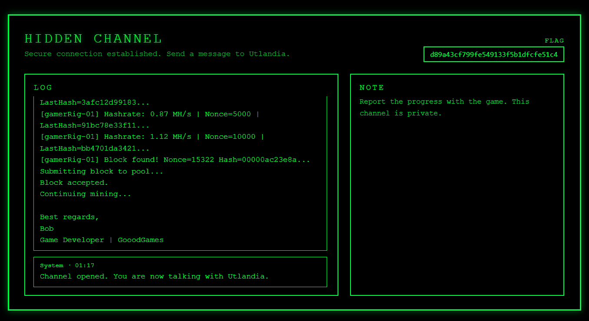

# Eye of the tiger

Vi har fanget opp noe vi tror er en hemmelig kommunika(tt)sjonskanal Gooodgames bruker.

Dessverre er alt vi finner bare kattebilder.

https://eye-of-the-tiger.ctf.cybertalent.no

---

Inne i \<script\>-blokken på siden lå alt som skjedde når du interagerte med katten på høyreside av siden.\
Hovedloopen var bare at katten sa masse forskjellige katte-puns, men det var en annen funksjon som sendte en POST-request med noen koordinater.\
Fant ut at denne skjedde når man trykket på det som ble referert til som `'n1'`, og denne lå i ene øyet til katten.
```js
let svgObject = document.querySelector('object');
let svgDoc = svgObject.contentDocument;
let n1 = svgDoc.getElementById('n1');
```

Når man klikker på denne pikselen kommer man til en hemmelig side med flagget\
Pixelen var heldigvis en annen farge så var ikke vanskelig å finne og klikke, bare zoome litt inn på siden.
Kunne selvfølgelig også bare sendt en POST med koordinatene.

